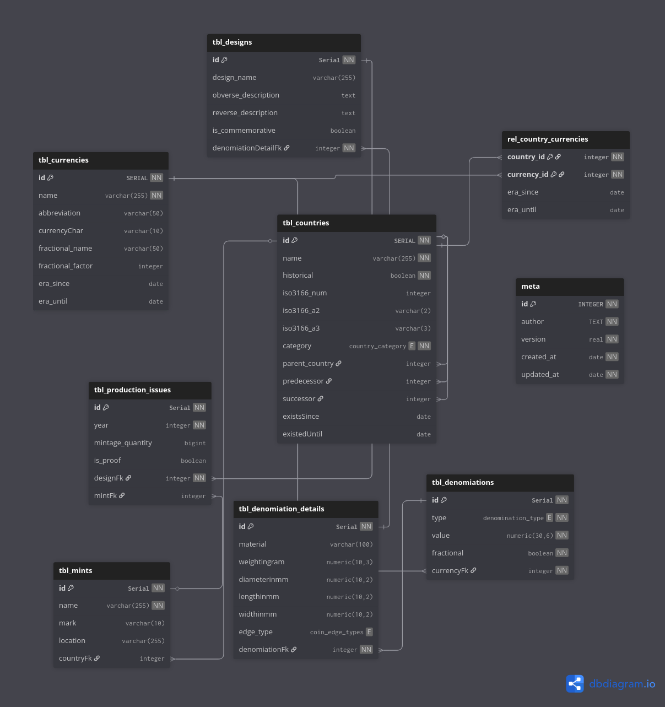

## Table of Contents

- [What This Repository Provides](#what-this-repository-provides)
- [Architecture Overview](#architecture-overview)
- [Table Descriptions](#table-descriptions)
  - [Geopolitical Layer](#1-geopolitical-layer)
  - [Monetary Layer](#2-monetary-layer)
  - [Object Body (Denominations & Details)](#3-object-body-denominations--details)
  - [Artwork (Designs)](#4-artwork-designs)
  - [Production Record (Issues)](#5-production-record-issues)
- [Usage Guide: Practical Example](#usage-guide-practical-example)
- [Data Hierarchy Summary](#data-hierarchy-summary)
- [Other](#other)
- [License](#license)

# World-Currencies Database Schema

This repository contains the core relational schema for the world-currencies-db. The database is designed to handle the complexity of numismatic history—ranging from ancient empires to modern polymer banknotes—using a strict hierarchical logic.

# What This Repository Provides

- **Prebuilt Database File**  
  Ready-to-use `.db` database file for immediate querying and integration

- **SQL DDL Files**  
  `CREATE TABLE` statements for initializing the database structure from scratch

- **SQL DML Files**  
  Curated `INSERT` commands for seed data (countries, currencies, denominations, ...)

- **Data Insert Files**
  Plain SQL data insert statements for each table

- **Backup Files**
  Backups of each table exported to `.csv`

# Architecture Overview

The data flows through six logical layers:

1. **Geopolitics & Geography** (`countries`): The physical and political space.
2. **Monetary Systems** (`currencies`): The legal tender definitions.
3. **Units of Value** (`denominations`): The specific "face value" (e.g., 5 Dollars).
4. **Physical Form** (`details`): Technical specs like weight, size, and material.
5. **Artistic Expression** (`designs`): The visual motifs and descriptions.
6. **Production** (`mints` & `issues`): The actual event of minting/printing in a specific year.

# Table Descriptions

  

## 1. Geopolitical Layer

* **`tbl_countries`**: The foundation. It stores modern and historical entities.
* **Hierarchy:** Supports `parent_country` (for dependencies) and recursive `predecessor`/`successor` links to track how countries evolved (e.g., Prussia ➔ German Empire).
* **Categories:** Strict classification into Sovereign States, Dependencies, Autonomous Regions, or Special Entities.
* **`tbl_mints`**: A registry of mints and printing houses, linked to their respective countries.

## 2. Monetary Layer

* **`tbl_currencies`**: Definitions of currency units. Includes `fractional_factor` (e.g., 100 for Cent/Euro) and era timestamps.
* **`rel_country_currencies`**: A many-to-many mapping. This is crucial because countries change currencies over time (e.g., France switching from Franc to Euro).

## 3. Object Body (Denominations & Details)

* **`tbl_denominations`**: Defines the "Face Value" (e.g., 5.00) and whether the object is a `coin` or `banknote`.
* **`tbl_denomiation_details`**: The "hard specs".
* **Coins:** Stores `weightingram`, `diameterinmm`, and `edge_type` (smooth, ribbed, or inscription).
* **Banknotes:** Stores `lengthinmm` and `widthinmm`.
* **Normalization:** If the specs don't change for 50 years, we only store them once here.

## 4. Artwork (Designs)

* **`tbl_designs`**: Focuses on the "Face" of the money.
* Stores `obverse_description` and `reverse_description`.
* Includes the `is_commemorative` flag to separate standard circulation from special collector issues.

## 5. Production Record (Issues)

* **`tbl_production_issues`**: The most granular level.
* Maps a specific **Design** to a **Year** and a **Mint**.
* Stores `mintage_quantity` and quality indicators like `is_proof`.

---

# Usage Guide: Practical Example

**Scenario: A user looks for an Indian 10-Rupee note from 2018.**

1. **Geography:** Look up "India" in `tbl_countries` and find the active "Rupee" in `tbl_currencies`.
2. **Value:** Search `tbl_denominations` where `value = 10` and `type = banknote`.
3. **Physical Specs:** Join with `tbl_denomination_details` to retrieve the dimensions (e.g., 137mm width).
4. **Find the Variant:** Filter `tbl_production_issues` for `year = 2018`.
5. **Final Result:** The app displays the `design` (e.g., "Sun Temple motif"), the total `mintage_quantity`, and the specific `mint` that printed it.

---

# Data Hierarchy Summary

> **Country** ➔ has **Currencies** ➔ have **Denominations** ➔ have **Physical Specs** ➔ have **Designs** ➔ minted in **Production Issues (Years)**.

# Other
- [NumisLib Website](https://numislib.com)
- [NumisLib GitHub](https://github.com/NumisLib)

---
# License

See [LICENSE](./LICENSE).

--- 

&copy; [NumisLib](https://numislib.com) / [Luca-Pascal Junge](https://github.com/lpj-app). Licensed under MIT.